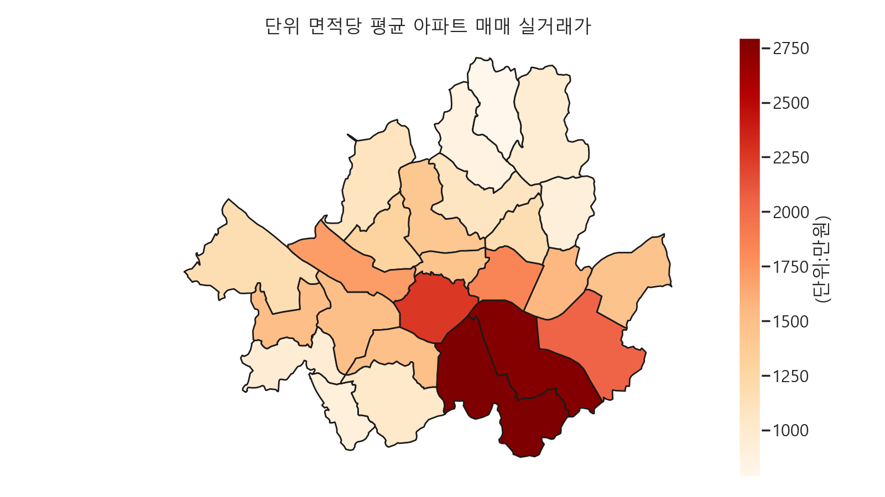

# 🏙️ 서울시 구별 아파트 매매 실거래가 시각화 

## 📌 프로젝트 개요
이 프로젝트는 **서울시 구별 단위 면적당 평균 아파트 매매 실거래가**를 지도 히트맵 형태로 시각화
데이터는 **국토교통부 실거래가 공개시스템 API**와 **SGIS 행정구역 경계 데이터**를 활용하여 구축

---

## 📊 데이터 출처
1. **법정동 코드 & 아파트 매매 실거래가**
   - 제공 기관: [국토교통부](https://www.data.go.kr/)
   - API: 아파트 매매 실거래가, 법정동 코드
   - 데이터 내용: 거래일, 단지명, 전용면적, 거래금액, 법정동 코드 등

2. **행정 지리 데이터**
   - 제공 기관: [SGIS 통계지리정보서비스](https://sgis.kostat.go.kr/)
   - 데이터 내용: 서울시 구별 행정구역 경계(GeoJSON)

---

## 🛠 기술 스택
- **Python**
- **GeoPandas**: 공간 데이터 처리
- **Plotly**: 인터랙티브 지도 시각화
- **Streamlit**: 웹 애플리케이션 배포
- **Pandas**: 데이터 전처리
- **Requests**: API 데이터 수집

---

## 📍 주요 기능
- 📥 **API 자동 수집**: 국토교통부 API에서 최신 아파트 매매 실거래가 데이터 가져오기
- 🗺 **지도 히트맵 시각화**: Plotly 기반 구별 평균 실거래가 표시
- 🎚 **필터링**: 가격 범위 조정, 특정 지역 선택
- 🖱 **상세 정보 확인**: 지도에서 지역 Hover 시 평균가·거래 건수·최고가 표시
- 🌐 **웹 배포**: Streamlit으로 간편하게 웹 서비스 실행

---
## 🗺️ 지도 히트맵 시각화

1. **가격의 지역적 불균형**  
강남구, 서초구, 송파구가 매우 진한 붉은색으로 표시되어 있어, 단위 면적당 아파트 가격이 가장 높음.  
-> 이는 서울의 전통적인 고가 주거지역 분포와 일치하며, 교육·교통·생활 인프라가 잘 갖춰진 지역이라는 점이 반영된 것으로 보임.

2. **강북과 강남의 뚜렷한 격차**  
한강을 기준으로 남쪽(특히 강남 3구)이 북쪽에 비해 평균 가격이 훨씬 높음.  
-> 강북 일부(종로구, 중구, 용산구)는 비교적 높은 가격대이나, 전체적으로는 강남 대비 연한 색을 띔.

3. **외곽지역의 낮은 가격대**  
서울 서쪽·북동쪽 외곽(은평구, 강북구, 도봉구, 노원구, 강서구, 구로구 등)은 가격이 낮은 편.  
-> 이는 중심부 접근성, 개발 정도, 주택 연식 등이 영향을 줄 가능성이 큼.

4. **경제·개발 요인과의 연관성**  
가격이 높은 지역은 대체로 학군·교통·상권이 밀집된 곳이며, 재건축·재개발 기대감이 큰 지역과도 겹침.  
-> 반대로 낮은 지역은 신축 공급이 상대적으로 적거나 개발 호재가 적은 경우가 많음.

---

## 🌐 웹 서비스 실행
    ```
    pip install -r requirements.txt
    streamlit run app.py
    ```

### 결과
